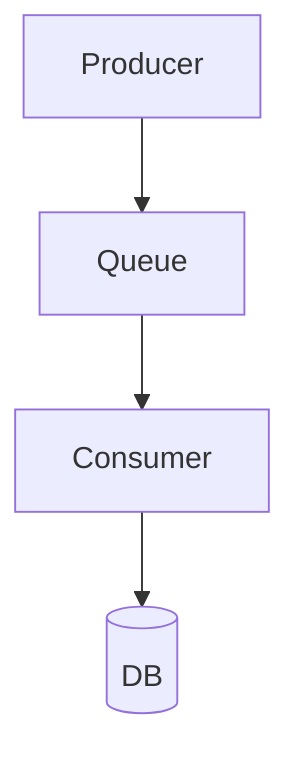

# Purpose

This repo is a personal knowledge base covering system design,
Node.js/TypeScript patterns, and architecture decisions learned from
production experience and interview prep.

Three consumers:

- AI-queryable   — every file must be self-contained and queryable
- Obsidian       — wikilinks, tags, and frontmatter must be valid
- Docusaurus     — Mermaid diagrams, internal links, static build

## File creation rules

Every new file must start with YAML frontmatter:

```yaml
---
title: "Exact title"
tags: [tag1, tag2]           # lowercase, hyphenated
related:
  - "[[other-file]]"         # Obsidian wikilink syntax
created: YYYY-MM-DD
status: draft | stable       # draft until reviewed
---
```

File naming: kebab-case.md, always. Match the title slug.
One concept per file. If a file exceeds ~300 lines, split it.

## Required sections in every doc

### TL;DR
2–3 sentence summary. Optimised for RAG retrieval — must stand alone.

### Context / problem
What situation triggers this pattern? What goes wrong without it?
Use a real production scenario, not a toy example.

### Solution
Explain the pattern. Use a Mermaid diagram for any flow with 3+ steps.

### Concrete example
Code or config that reflects real-world usage (e.g. BullMQ job, Postgres
query, TypeScript generic). Not "foo/bar" — use a plausible domain
(e-commerce, SaaS billing, notification service, etc.).

### Tradeoffs
Honest pros and cons. Include the failure modes.

### Related concepts
Wikilinks only: [[saga-pattern]], [[outbox-pattern]], etc.
This section drives the graph in Obsidian and navigation in Docusaurus.

## Linking rules

- Internal links: always [[filename-without-extension]]
- Never use relative markdown paths like ../caching/redis.md
- Cross-domain links are encouraged — the graph value comes from them
- If you reference a concept that doesn't have a file yet, still link it
  (Obsidian will show it as an unresolved node — that's intentional)

## Diagrams

Use Mermaid fenced blocks. Prefer flowchart TD for flows,
sequenceDiagram for protocol/message exchanges.
Keep diagrams focused — one diagram per concept, not one mega-diagram.



## Tone and depth

- Write for a senior engineer who hasn't seen this specific pattern before
- Skip basics (don't explain what a Promise is)
- Prefer concrete over abstract: real library names, real failure modes
- Opinions are welcome — note them as such with > **Opinion:**

## What to avoid

- No generic "use case 1 / use case 2" examples
- No Wikipedia-style neutral tone — this is a practitioner's brain
- No sections without content (remove a section if you have nothing to say)
- Don't link to external URLs in body text — use a ## References section at the end

## Folder map

system-design/   fundamentals, CAP, scalability
databases/        indexing, replication, sharding, transactions
caching/          strategies, invalidation, Redis, CDN
async-and-queues/ BullMQ, events, saga, outbox, backpressure
architecture/     monolith→micro, DDD, strangler fig, deployments
api-design/       REST, GraphQL, gRPC, pagination, versioning
observability/    logging, metrics, tracing, SLOs
typescript/       type patterns, generics, DI, error handling
_meta/            index, reading list, interview prep
_templates/       concept.md, pattern.md, adr.md
