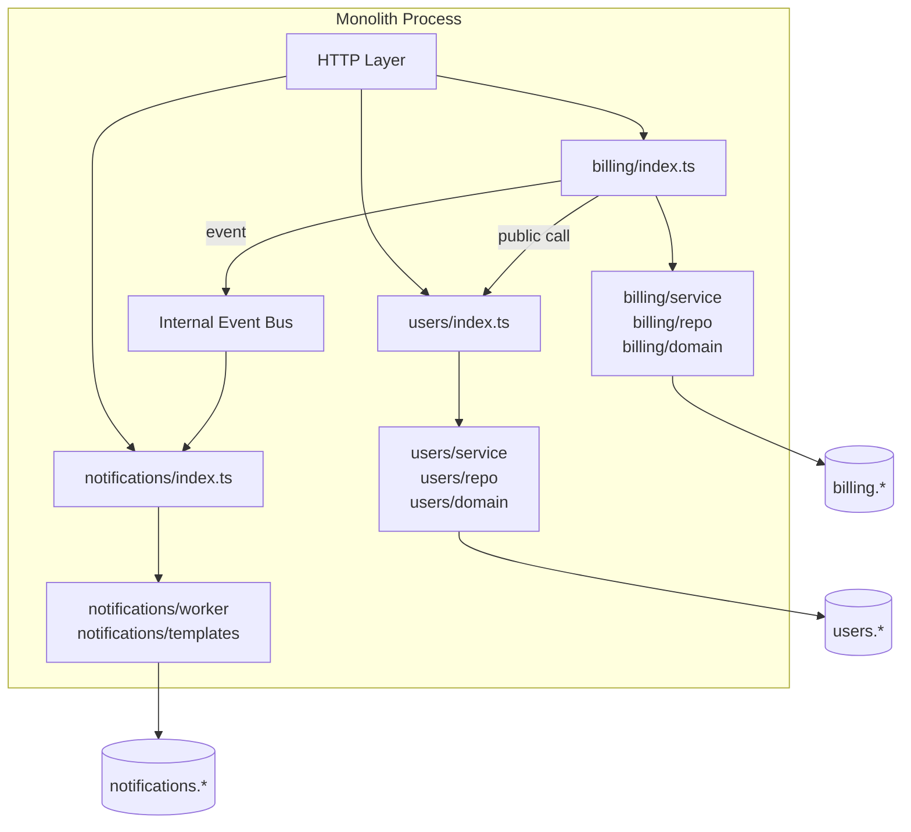

## TL;DR

A modular monolith is a single deployable unit where modules are strictly isolated: no cross-module direct imports, each module owns its data, and inter-module communication goes through defined public APIs. It captures most of the design benefits of microservices without the distributed-systems overhead, and is the safest intermediate stop when migrating out of a big ball of mud.

## Context / problem

You're three years into a Node.js/TypeScript SaaS codebase. It started with clean intent but has drifted: `billing` imports directly from `users`, `notifications` reads from the `orders` Postgres table, and `auth` middleware has grown business logic for three different domains. Every change risks a cascade. Test suites are slow because everything is coupled.

You've heard the argument for microservices, but your team is eight engineers. The overhead of a service mesh, per-service CI pipelines, distributed tracing, and cross-service deploys would consume most of your engineering bandwidth before delivering any business value.

The real problem isn't deployment coupling — it's code coupling. And you can fix code coupling without splitting the process.

## Solution

Reorganise the codebase into modules that mirror bounded contexts. Each module:
- has a single entry point (`index.ts`) that defines its public API
- owns its Postgres schema (separate schema prefix or separate tables, never shared)
- never imports from another module's internals
- communicates with other modules via the public API or an internal event bus



### Enforcing boundaries

Boundaries rot without tooling. Use ESLint or a custom import checker to fail CI when a module reaches into another module's internals:

```json
// .eslintrc — no-restricted-imports per module
{
  "rules": {
    "no-restricted-imports": ["error", {
      "patterns": [
        { "group": ["*/billing/service", "*/billing/repo"], "message": "Import from billing/index only." },
        { "group": ["*/users/service", "*/users/repo"],    "message": "Import from users/index only." }
      ]
    }]
  }
}
```

For stricter enforcement, tools like **Nx** or **Turborepo** model modules as explicit packages with declared dependencies — import violations break the build.

### Data ownership

Each module owns its tables. Enforce this at the Postgres level with schemas:

```sql
-- billing module owns everything in the billing schema
CREATE SCHEMA billing;
CREATE TABLE billing.invoices ( ... );
CREATE TABLE billing.subscriptions ( ... );

-- users module owns its own schema
CREATE SCHEMA users;
CREATE TABLE users.accounts ( ... );
```

A module should never `JOIN` across schemas in application code. If billing needs a user's email, it calls `users.getEmailById(userId)` — a function call, not a query.

### Internal event bus

For async communication between modules, use a lightweight in-process event emitter rather than HTTP calls or a real message broker:

```typescript
// shared/event-bus.ts
import { EventEmitter } from 'events';
export const internalBus = new EventEmitter();

// billing/service.ts — emit after invoice is paid
internalBus.emit('billing.invoice_paid', { userId, invoiceId, amount });

// notifications/index.ts — subscribe at startup
internalBus.on('billing.invoice_paid', async ({ userId, invoiceId, amount }) => {
  await notificationService.send(userId, 'invoice_paid', { invoiceId, amount });
});
```

When you eventually extract a module to a microservice, this in-process bus gets replaced with a real queue (BullMQ, Kafka). The module's own code barely changes — only the bus adapter.

## Concrete example

A SaaS billing platform refactors its `billing` module to be self-contained. Before:

```typescript
// billing/service.ts — before: reaches into users internals
import { UserRepository } from '../users/repo/user-repository';
import { db } from '../shared/db';

async function createInvoice(userId: string, amount: number) {
  const user = await UserRepository.findById(userId); // direct internal import
  await db.query(
    `INSERT INTO invoices (user_id, email, amount) VALUES ($1, $2, $3)`,
    [userId, user.email, amount]
  );
}
```

After — billing only knows the public `users` contract:

```typescript
// users/index.ts — public API surface
export { getUserById } from './service/user-service';
export type { UserPublicProfile } from './domain/user';

// billing/service.ts — after: imports from public index only
import { getUserById } from '../users';

async function createInvoice(userId: string, amount: number): Promise<Invoice> {
  const user = await getUserById(userId);
  return billingRepo.createInvoice({ userId, email: user.email, amount });
}
```

The `billing` module's unit tests now mock `users/index` at the boundary — a clean seam with no knowledge of how users are stored.

## Tradeoffs

**Pros**
- Single deploy, single observability pipeline, shared DB connection pool — operational simplicity of a monolith
- Module boundaries force domain clarity now, making future extraction to microservices low-risk
- No network hops between modules — cross-module calls are function calls; P99 latency doesn't compound
- Easier to onboard — one repo, one process, one place to debug

**Cons**
- Still a single deploy unit — a crash or memory leak in one module takes down the whole process; you cannot scale modules independently
- Shared runtime means a CPU-intensive module (PDF generation, report building) can starve others; needs care with worker threads or process offloading
- Boundary enforcement is social + tooling, not enforced by the OS or network — discipline erodes under deadline pressure without automated checks

**Failure modes**
- **Leaky abstractions**: a module's internal type leaks into another module's code via a shared utility. Now the "boundary" is fiction. Keep shared utilities truly generic — no domain types.
- **God event bus**: every module listens to every event and the bus becomes implicit coupling. Event names must be namespaced (`billing.invoice_paid`, not `invoice_paid`) and listeners documented.
- **Skipping the step**: teams jump from big ball of mud directly to microservices under pressure. The seams were never clean, and what they get is a distributed ball of mud.

> **Opinion:** The modular monolith is underrated as a *permanent* architecture, not just a waypoint. For teams under ~15 engineers, it's often the right final answer. The extraction to microservices should be driven by a specific, measured constraint — not by the desire to have microservices.

## Related concepts

[[monolith-to-microservices]]
[[strangler-fig-pattern]]
[[domain-driven-design]]
[[dual-write-pattern]]
[[outbox-pattern]]
[[event-driven-architecture]]
