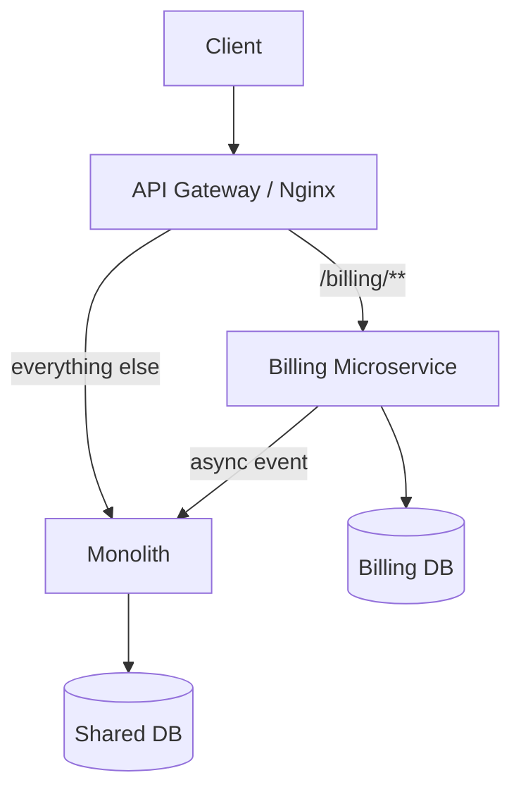
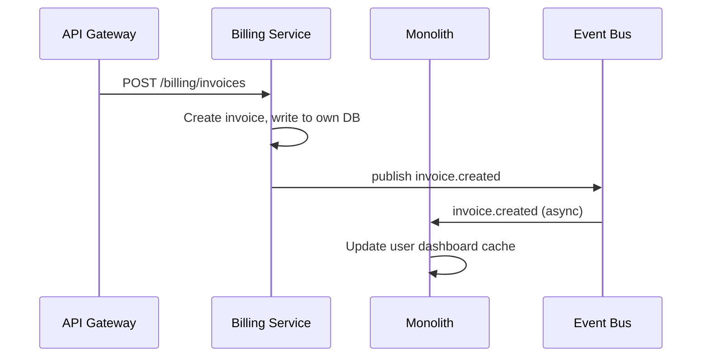

## TL;DR

Breaking a monolith into microservices is a migration strategy, not a greenfield decision. The proven path goes monolith → modular monolith → microservices: enforce hard module boundaries first, then extract services once those seams are stable. [[strangler-fig-pattern]] handles the extraction incrementally behind a routing proxy. Do it domain-by-domain, and don't split until the seam is clean.

## Context / problem

You're running a Node.js/TypeScript monolith for a SaaS billing platform. It started as a clean Express app; three years later it's 400k lines, 12 engineers stepping on each other, and the billing module deploys lock the entire product. A single slow Postgres query in the invoicing service can timeout the auth middleware. Scaling the PDF-generation worker means scaling the entire process, including all the parts that don't need it.

The business wants faster deploys and independent scaling. The engineering team wants service ownership. But a big-bang rewrite has a near-zero success rate — you need to migrate while the system keeps running.

## Solution

Before extracting any service, consider the **modular monolith** as an explicit intermediate step. Refactor the codebase into isolated modules — each with its own public API, no cross-module direct imports, and ideally a separate schema or DB schema prefix. This disciplines the seams without paying the distributed-systems tax yet. Once a module is stable and its interface clean, extraction is low-risk and fast.


The canonical extraction technique is the **[[strangler-fig-pattern]]**: introduce a routing layer (an API gateway or reverse proxy) in front of the monolith, then extract one bounded context at a time. Traffic for the extracted service routes to the new microservice; everything else still hits the monolith. When extraction is complete, the monolith is gone.



### Decomposition sequence

1. **Identify bounded contexts** — use DDD to find seams. Billing, notifications, auth, and PDF generation are usually clean candidates early. Avoid splitting along technical layers (controllers vs. services vs. repos) — that produces distributed monoliths.

2. **Own your data first** — before extracting any logic, the new service needs its own database. Run both writes in parallel (dual-write or [[outbox-pattern]]) until you're confident, then cut over reads, then stop writing to the shared DB.

3. **Extract the interface** — deploy the new service behind the gateway. Use feature flags to shadow-route a percentage of traffic. Compare responses against the monolith output before cutting over.

4. **Break the synchronous coupling** — calls that were in-process function calls now cross a network. Replace with async messaging ([[saga-pattern]]) where possible; keep sync HTTP only for user-facing reads with strict latency requirements.

5. **Remove the dead code from the monolith** — non-negotiable. If you don't delete it, the monolith grows a phantom copy that diverges silently.



## Concrete example

A SaaS platform extracts its **notification service** first — it's high-churn, has no upstream dependencies, and the monolith already passes it an event struct.

```typescript
// Before: monolith internal call
import { NotificationService } from '../notifications/service';

await NotificationService.send({
  userId,
  type: 'invoice_paid',
  payload: { invoiceId, amount },
});

// After: publish to BullMQ, notification service consumes it
import { notificationQueue } from '../queues/notification';

await notificationQueue.add('send', {
  userId,
  type: 'invoice_paid',
  payload: { invoiceId, amount },
});
```

The notification microservice is a standalone Node.js process with its own BullMQ worker:

```typescript
// notification-service/src/worker.ts
import { Worker } from 'bullmq';
import { sendEmail } from './email';
import { sendPush } from './push';

const worker = new Worker('notification', async (job) => {
  const { userId, type, payload } = job.data;

  const prefs = await db.userPrefs.findByUserId(userId);

  if (prefs.email) await sendEmail(userId, type, payload);
  if (prefs.push) await sendPush(userId, type, payload);
}, { connection: redis });
```

The monolith knows nothing about the notification service's internals. The contract is the queue message shape — version it with a `v` field from day one.

## Tradeoffs

**Pros**
- Independent deploy cadence per service — billing can ship 10x/day without touching auth
- Horizontal scaling at the service level — PDF workers scale separately from API handlers
- Team ownership maps to service boundaries — reduces coordination overhead

**Cons**
- Distributed transactions are now your problem — what was a single DB transaction is now two services and a queue; you need [[saga-pattern]] or [[outbox-pattern]] to avoid partial failures
- Network latency compounds — a request that hit 3 internal functions now crosses 3 HTTP calls; P99 degrades fast without circuit breakers ([[circuit-breaker-pattern]])
- Operational complexity jumps immediately — you need per-service logging, tracing, health checks, and deployment pipelines before you have any business value from the split
- Data consistency is eventual — if your product guarantees strong consistency, microservices make that harder to preserve

**Failure modes**
- **Distributed monolith**: services that share a database or call each other synchronously in a chain. You get all the ops complexity with none of the autonomy benefits.
- **Premature extraction**: splitting a context before the seam is stable. The interface changes constantly and you're doing dual-maintenance.
- **Abandoned strangler**: the proxy and dual-write code stay in forever because nobody has time to finish the migration. Schedule the cutover as a hard deadline.

> **Opinion:** Extract at most one service per quarter in a team of 10. The ops burden of going faster than that exceeds the delivery benefit. Most teams underestimate how long "cleaning up the monolith side" takes.

## Related concepts

[[strangler-fig-pattern]]
[[modular-monolith]]
[[domain-driven-design]]
[[saga-pattern]]
[[outbox-pattern]]
[[circuit-breaker-pattern]]
[[api-gateway]]
[[event-driven-architecture]]
[[dual-write-pattern]]
