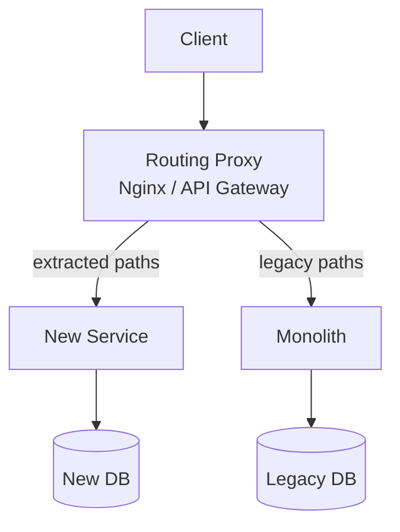
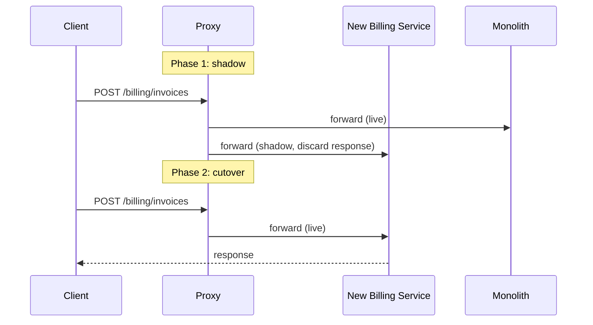

## TL;DR

The strangler fig pattern migrates a legacy system incrementally by routing traffic through a proxy: new code handles the extracted paths, the old system handles everything else. You strangle the monolith piece by piece until it can be deleted. No big-bang rewrite, no flag day.

## Context / problem

You have a production Node.js monolith serving thousands of requests per minute. The billing module is the most critical — and the most painful to change. It's tightly coupled to the user module, shares DB transactions with the notification layer, and hasn't been touched by anyone currently on the team. You need to extract it, but you cannot take downtime and you cannot stop shipping features while the migration runs.

The alternative — a parallel rewrite — doubles your maintenance surface and historically ends with the rewrite never catching up to the production system. You need a strategy that lets both systems coexist and lets you cut over incrementally.

## Solution

Name comes from the strangler fig tree, which grows around a host tree and eventually replaces it. You introduce a routing layer in front of the existing system. New functionality and extracted modules live in the new service; unextracted paths still flow through the legacy system. Over time you expand what the new service handles until the legacy system receives no traffic and can be deleted.



### Step-by-step

1. **Insert the proxy** — put Nginx, a simple Express router, or a managed API gateway in front of the monolith. At this point it passes all traffic through. No behaviour change.

2. **Extract one bounded context** — pick the least-coupled module. Deploy it as a standalone service. Do not extract the DB yet — let the new service call the monolith's DB or an API on the monolith if needed as a temporary measure.

3. **Shadow traffic** — route a copy of real requests to both systems. Compare responses. Fix divergences before any real cutover. This is the step most teams skip and regret.

4. **Incremental cutover** — shift traffic using a feature flag or weighted routing (e.g., 5% → 25% → 100%). Monitor error rates and latency at each step. Have a rollback route ready.

5. **Own the data** — once the service handles 100% of traffic for that path, migrate data ownership. Use [[dual-write-pattern]] or [[outbox-pattern]] during the transition to avoid data loss.

6. **Delete the legacy code** — remove the dead path from the monolith. The proxy route still exists; now it points only to the new service.

7. **Repeat** — until the monolith handles no traffic, then decommission it.



## Concrete example

A SaaS platform extracts its billing service from a monolith. The proxy is a lightweight Express gateway:

```typescript
// gateway/src/router.ts
import httpProxy from 'http-proxy-middleware';
import { isBillingRoute } from './routing';
import { billingCutoverFlag } from './flags';

app.use(async (req, res, next) => {
  if (isBillingRoute(req.path) && await billingCutoverFlag.isEnabled()) {
    return httpProxy.createProxyMiddleware({
      target: process.env.BILLING_SERVICE_URL,
      changeOrigin: true,
    })(req, res, next);
  }
  next(); // falls through to monolith handler
});
```

Shadow mode — fire-and-forget copy to the new service for comparison:

```typescript
async function shadowRequest(req: Request): Promise<void> {
  try {
    const response = await fetch(`${process.env.BILLING_SERVICE_URL}${req.path}`, {
      method: req.method,
      headers: req.headers as HeadersInit,
      body: req.method !== 'GET' ? JSON.stringify(req.body) : undefined,
      signal: AbortSignal.timeout(2000), // never block the live path
    });
    await compareShadowResponse(req, response);
  } catch {
    // shadow failures are logged, never propagated
    metrics.increment('shadow.billing.error');
  }
}
```

The monolith's billing code stays untouched until the new service is at 100% and the shadow comparisons are clean. Only then is the legacy path deleted.

## Tradeoffs

**Pros**
- Zero-downtime migration — users never see a flag day
- Reversible at any step — rollback is a config change in the proxy
- Forces you to define a clean API boundary before extraction, which improves both systems
- Shadow mode catches divergences before they become incidents

**Cons**
- The proxy is a new component to operate and monitor — it must not become a single point of failure
- Shadow traffic doubles load on the new service during testing; budget for it
- You carry maintenance burden on both systems until extraction is complete; the longer it drags, the more expensive it gets
- Data migration is the hardest part — the routing strategy only handles the request layer

**Failure modes**
- **Proxy becomes a bottleneck**: keep the routing layer stateless and simple. Any logic that grows in it will be hard to reason about and test.
- **Shadow divergences ignored**: teams disable shadow mode because fixing divergences is slow. This is the signal that the extraction isn't clean — fix the divergences, don't silence them.
- **Never finishing**: the strangler fig works only if you have a committed endpoint date. Without it, the monolith and new service coexist indefinitely. Treat each extraction as a project with a deadline.

> **Opinion:** The proxy is the strangler's most underrated risk. Teams spend months on the service logic and deploy the proxy as an afterthought. It deserves the same reliability treatment as the systems it routes between — health checks, circuit breakers, and its own runbook.

## Related concepts

[[monolith-to-microservices]]
[[modular-monolith]]
[[api-gateway]]
[[dual-write-pattern]]
[[outbox-pattern]]
[[feature-flags]]
[[circuit-breaker-pattern]]
