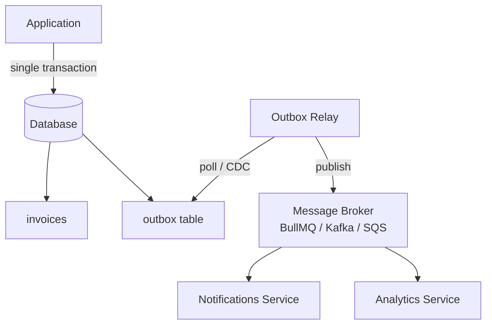

## TL;DR

The outbox pattern solves the dual-write problem: persisting a DB change and publishing a message atomically. Write both the business record and the outgoing event to the same DB transaction. A separate relay process reads the outbox table and publishes to the message broker. If the relay crashes, it retries — no event is lost, no event is fabricated.

## Context / problem

A SaaS billing service marks an invoice as paid and must publish an `invoice.paid` event for downstream consumers (notifications, analytics, revenue recognition). The naive approach:

```typescript
await db.query(`UPDATE invoices SET status = 'paid' WHERE id = $1`, [invoiceId]);
await messageQueue.publish('invoice.paid', { invoiceId }); // what if this fails?
```

Two outcomes break correctness:
- The DB write succeeds, the publish fails → invoice is paid, nobody downstream knows
- The publish succeeds, the DB write fails (or crashes mid-flight) → event fired for a payment that didn't happen

You cannot wrap a DB transaction and a network call in the same atomic unit. The outbox pattern sidesteps this by making the event publication a DB write — and therefore part of the same transaction.

## Solution

Add an `outbox` table to your database. Within the same transaction that mutates business data, insert a row into `outbox`. A separate relay process (the **outbox relay**) polls or streams from `outbox`, publishes each event to the broker, and marks the row as processed.



### Outbox table schema

```sql
CREATE TABLE outbox (
  id          UUID PRIMARY KEY DEFAULT gen_random_uuid(),
  topic       TEXT        NOT NULL,
  payload     JSONB       NOT NULL,
  created_at  TIMESTAMPTZ NOT NULL DEFAULT now(),
  published_at TIMESTAMPTZ,          -- null = pending
  attempts    INT         NOT NULL DEFAULT 0
);

CREATE INDEX ON outbox (published_at, created_at)
  WHERE published_at IS NULL;        -- partial index — relay only scans pending rows
```

### Application side

The business logic and the outbox write happen in one transaction:

```typescript
async function markInvoicePaid(invoiceId: string): Promise<void> {
  await db.transaction(async (trx) => {
    await trx.query(
      `UPDATE invoices SET status = 'paid', paid_at = now() WHERE id = $1`,
      [invoiceId]
    );

    await trx.query(
      `INSERT INTO outbox (topic, payload)
       VALUES ($1, $2)`,
      ['invoice.paid', JSON.stringify({ invoiceId, v: 1 })]
    );
  });
}
```

If the transaction rolls back for any reason, the outbox row is also rolled back. No orphaned event.

### Relay process

The relay runs as a separate process (or a lightweight background job). Two implementation strategies:

**Polling** — simple, works everywhere, adds latency proportional to poll interval:

```typescript
async function runOutboxRelay(): Promise<void> {
  while (true) {
    const rows = await db.query<OutboxRow>(`
      SELECT id, topic, payload
      FROM outbox
      WHERE published_at IS NULL
      ORDER BY created_at
      LIMIT 50
      FOR UPDATE SKIP LOCKED
    `);

    for (const row of rows.rows) {
      try {
        await broker.publish(row.topic, row.payload);
        await db.query(
          `UPDATE outbox SET published_at = now() WHERE id = $1`,
          [row.id]
        );
      } catch {
        await db.query(
          `UPDATE outbox SET attempts = attempts + 1 WHERE id = $1`,
          [row.id]
        );
      }
    }

    await sleep(500); // 500ms poll interval
  }
}
```

`FOR UPDATE SKIP LOCKED` is critical — it prevents two relay instances from picking up the same row, enabling horizontal scaling of the relay without a distributed lock.

**Change Data Capture (CDC)** — zero polling lag, lower DB load at scale. Tools like **Debezium** tail the Postgres WAL and publish row inserts as events directly. No relay process to write; more infrastructure to operate.

## Concrete example

A billing platform ships with the polling relay. The relay is extracted into its own Node.js worker process alongside BullMQ consumers:

```typescript
// workers/outbox-relay.ts
import { db } from '../db';
import { billingQueue } from '../queues/billing';

const BATCH = 100;
const POLL_MS = 300;

async function relay(): Promise<void> {
  const { rows } = await db.query<{ id: string; topic: string; payload: unknown }>(`
    SELECT id, topic, payload FROM outbox
    WHERE published_at IS NULL
    ORDER BY created_at
    LIMIT $1
    FOR UPDATE SKIP LOCKED
  `, [BATCH]);

  await Promise.allSettled(
    rows.map(async (row) => {
      await billingQueue.add(row.topic, row.payload, {
        jobId: row.id,       // idempotency — BullMQ deduplicates same jobId
        attempts: 3,
        backoff: { type: 'exponential', delay: 1000 },
      });
      await db.query(
        `UPDATE outbox SET published_at = now() WHERE id = $1`,
        [row.id]
      );
    })
  );
}

setInterval(relay, POLL_MS);
```

Using `jobId: row.id` makes the BullMQ enqueue idempotent — if the relay crashes after publishing but before marking the row, the retry publishes the same `jobId` and BullMQ ignores the duplicate.

## Tradeoffs

**Pros**
- Atomic guarantee: business data and event intent are committed together or not at all
- No message broker dependency in the hot path — the application only writes to its own DB
- Relay failures are self-healing: it retries from where it left off
- Works with any relational DB and any message broker

**Cons**
- At-least-once delivery — consumers must be idempotent; the relay can publish a row more than once if it crashes between publish and mark
- Polling adds latency (typically 100ms–1s); CDC reduces this but adds operational complexity
- Outbox table grows unbounded without a cleanup job — add a scheduled delete for rows older than N days
- Adds a new process to operate and monitor

**Failure modes**
- **Relay falls behind**: if the application writes faster than the relay can publish, the outbox table grows and latency climbs. Monitor queue depth; scale relay horizontally using `SKIP LOCKED`.
- **Poison pill row**: a malformed payload causes the broker to reject it on every attempt. The relay gets stuck. Add a max-attempts circuit breaker and route dead rows to a dead-letter table.
- **Missing idempotency on consumers**: the relay guarantees at-least-once; a consumer that processes `invoice.paid` twice and charges the customer twice is a bug in the consumer, not the relay. Design all consumers to be idempotent from day one.

> **Opinion:** The outbox table cleanup job is easy to forget and painful when you remember it at 2am because the table hit 50M rows and is slowing down the relay index scan. Set up the `DELETE FROM outbox WHERE published_at < now() - interval '7 days'` cron job on day one.

## Related concepts

[[saga-pattern]]
[[dual-write-pattern]]
[[event-driven-architecture]]
[[monolith-to-microservices]]
[[circuit-breaker-pattern]]
